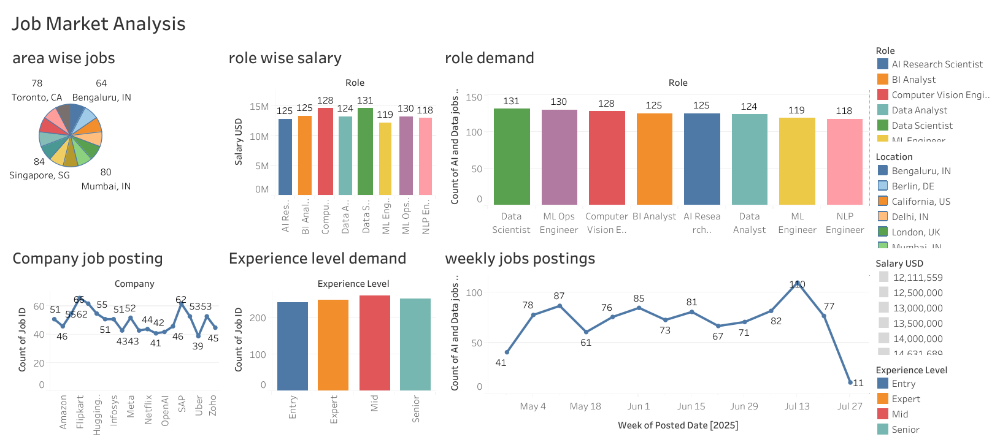

# Job-Market-Analysis
Exploring AI & Data Science job market trends through interactive Tableau visualizations! Dive into role demand, salaries, and top hiring cities with me. #DataAnalytics #Tableau
# Job Market Analysis Dashboard - Tableau Project

## Project Overview
This Tableau project analyzes the global AI and Data Science job market using real-world data. The interactive dashboard provides insights into job postings, role demand, salary comparisons, location-wise distribution, company hiring trends, and experience level requirements. It aims to help job seekers, recruiters, and data enthusiasts understand the dynamic trends in the tech job market.

## Dashboard Features
- **Area-wise Jobs:** Visualizes job distribution across major global cities, highlighting hotspots for AI and data science roles.
- **Role-wise Salary:** Compares average salaries for various tech roles, spotlighting the most lucrative opportunities.
- **Role Demand:** Displays the intensity of job demand for data and AI roles to guide career choices.
- **Company Job Posting:** Tracks hiring trends among leading companies in the AI and Data Science sectors.
- **Experience Level Demand:** Breaks down job availability by experience level—from entry to senior positions.
- **Weekly Job Postings:** Shows temporal trends and fluctuations in job market activity over time.

## Technologies Used
- Tableau Desktop / Tableau Public
- Public datasets on AI and Data Science job listings

## Dataset
The data used in this project includes job postings across multiple companies, locations, and roles in the AI and data fields. (Include dataset source if possible or upload dataset if allowed.)

## How to View
You can interact with the live dashboard published on Tableau Public here:  
[Link to Tableau Public Dashboard](https://public.tableau.com/views/JobMarketAnalysis_17582245916530/Dashboard1)

## Project Snapshot

*A quick glance at the project dashboard.*

## Contributing
Feedback, suggestions, and contributions are welcome! Feel free to open issues or submit pull requests.

## Contact
For questions, suggestions, or collaboration, please contact me via [LinkedIn](https://www.linkedin.com/in/yourprofile) or open an issue.

---

Thank you for visiting!

